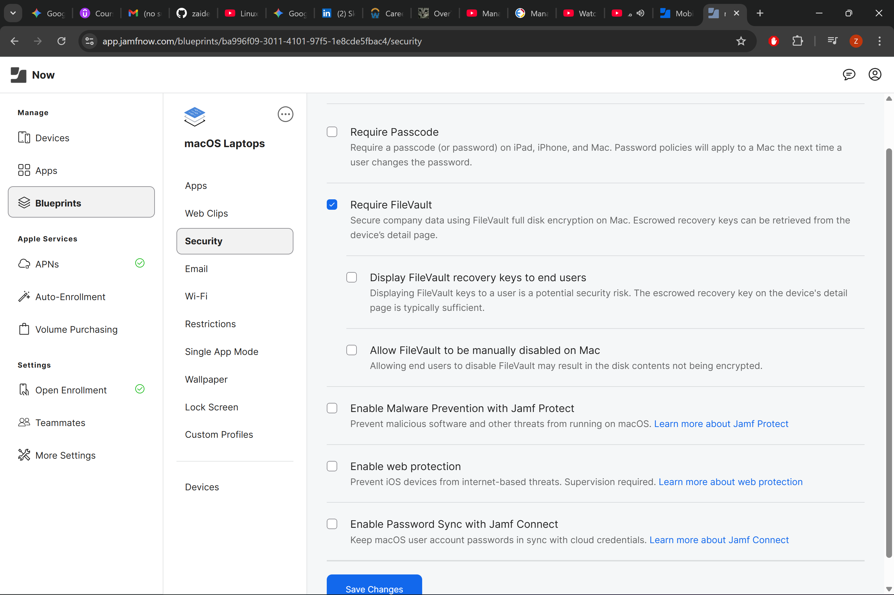

# 🍎 Jamf iOS Mobile Device Management (MDM) Lab

## Project Overview
This project documents the end-to-end configuration of an Apple Device Management environment using **Jamf Now**. I successfully established a trust relationship with Apple's infrastructure and managed a live iPhone 14 endpoint through its entire lifecycle.

---

## 🛠️ Phase 1: Infrastructure Trust (APNs)
To manage Apple devices, I established a secure handshake with the **Apple Push Notification service (APNs)**.
* **Handshake:** Generated a CSR in Jamf and validated it through the Apple Push Certificates Portal.
* **Result:** Successfully activated the MDM communication tunnel (Level 6 Informational).

*Validated active certificate on the Apple Portal.*

---

## 📱 Phase 2: Endpoint Enrollment
I utilized **User-Initiated Enrollment** to bring a personal iPhone 14 under management.
* **Device Identity:** Successfully enrolled "Z iPhone" into the inventory.
* **Verification:** Confirmed the "Management Profile" was installed and trusted on the device hardware.

| Jamf Inventory View | Device Settings View |
| :--- | :--- |
|  |  |

---

## 📦 Phase 3: Automated Software Deployment
I configured a **Blueprint** to automate the delivery of critical business applications.

| Blueprint Configuration (Cause) | End-User Experience (Effect) |
| :---: | :---: |
|  |  |

*The Blueprint on the left ensures that as soon as a device enrolls, the "App Installation" prompt for Microsoft Teams on the right is triggered automatically.*
---

## 💻 Phase 4: macOS Fleet Management (Security & Encryption)
To demonstrate cross-platform capability, I configured a management profile for **macOS Laptops**. This aligns with enterprise requirements for full-disk encryption and malware prevention.

* **Blueprint Logic:** Created a dedicated macOS policy to manage laptop-specific hardware security.
* **FileVault Enforcement:** Enabled mandatory **FileVault** full-disk encryption to secure data at rest.
* **Compliance Standards:** Staged Malware Prevention and Web Protection toggles to meet high-security infrastructure baselines.

*Configuring FileVault and security payloads for the macOS fleet.*

---

## 🧠 Key Skills Demonstrated
* **Certificate Management:** Managing `.pem` and `.plist` exchanges between Jamf and Apple.
* **UEM Logistics:** Understanding the flow of "Open Enrollment" and remote command triggers.
* **Security & Compliance:** Verifying signed certificates from "JAMF Software (483DWKW443)" to ensure device integrity.

---

## 🏛️ Enterprise Service Management (ITIL & Multi-Platform)

### 🔄 Unified Endpoint Management (UEM) Strategy
This lab completes a "Dual-Platform" management portfolio. By mastering **Jamf** alongside **ManageEngine Endpoint Central**, I have demonstrated the ability to maintain a heterogeneous fleet:
* **Windows Management:** Utilized ManageEngine for baseline vulnerability scanning and CLI-based agent remediation.
* **Apple Management:** Utilized Jamf for APNs lifecycle management and Blueprint-based security (FileVault).

### 📚 ITIL Framework Alignment
* **Service Configuration Management:** Tracked devices as **Configuration Items (CIs)** within the Jamf Asset Inventory.
* **Release Management:** Deployed software as **Standard Changes** via automated workflows.
* **Information Security Management:** Established a Root of Trust via encrypted APNs handshakes.

