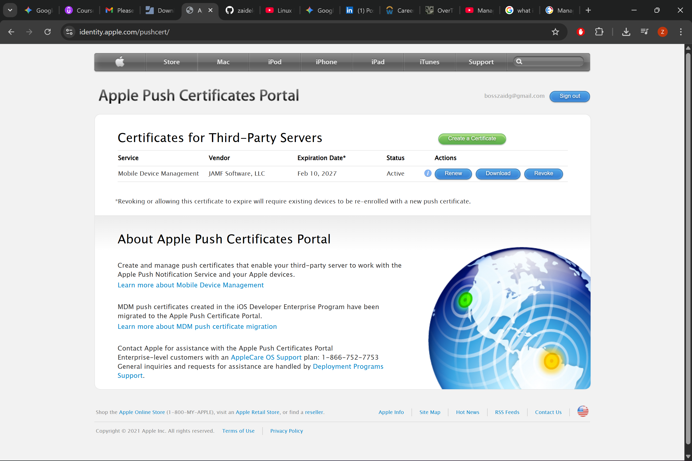
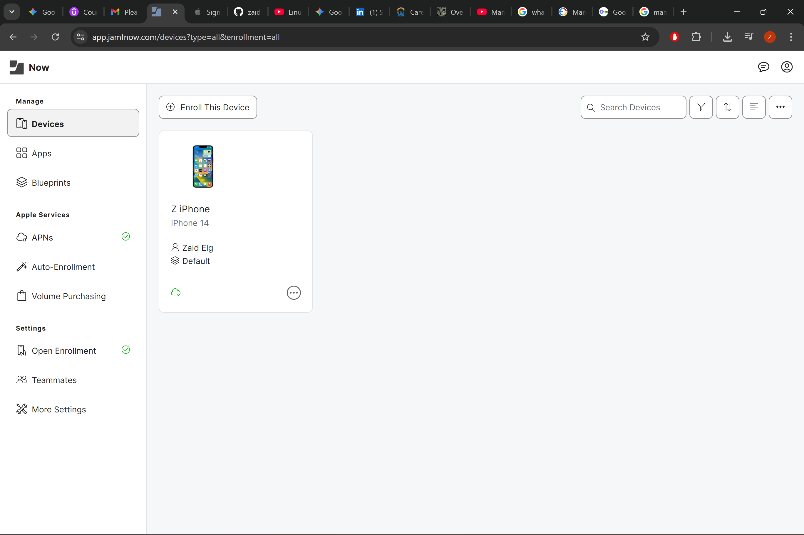
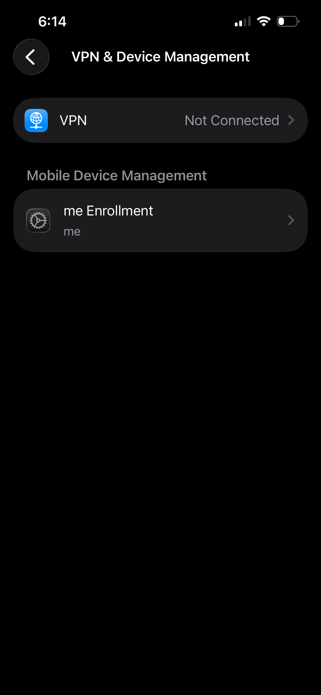
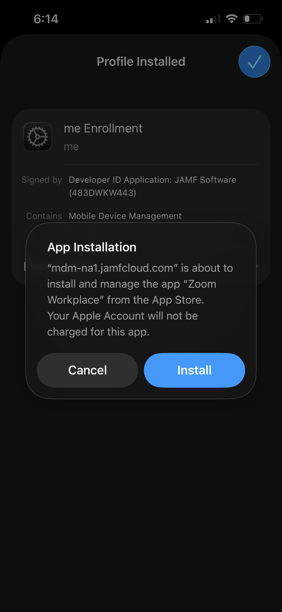
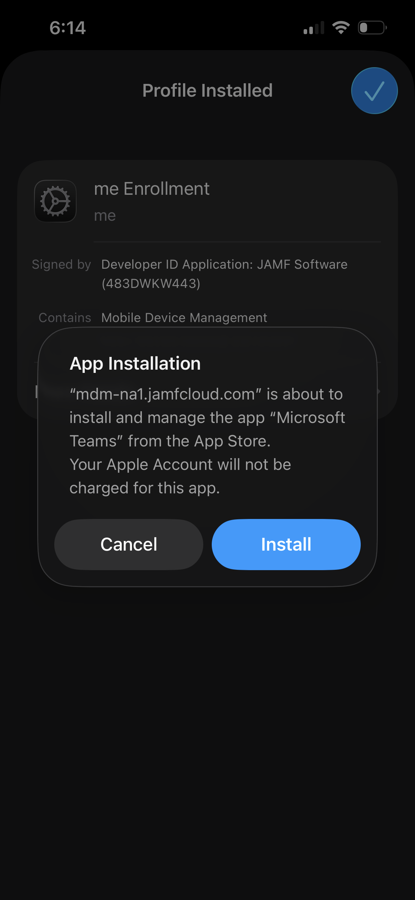

# 🍎 Jamf iOS Mobile Device Management (MDM) Lab

## Project Overview
This project documents the end-to-end configuration of an Apple Device Management environment using **Jamf Now**. I successfully established a trust relationship with Apple's infrastructure and managed a live iPhone 14 endpoint through its entire lifecycle.

---

## 🛠️ Phase 1: Infrastructure Trust (APNs)
To manage Apple devices, I established a secure handshake with the **Apple Push Notification service (APNs)**.
* **Handshake:** Generated a CSR in Jamf and validated it through the Apple Push Certificates Portal.
* **Result:** Successfully activated the MDM communication tunnel (Level 6 Informational).

*Validated active certificate on the Apple Portal.*

---

## 📱 Phase 2: Endpoint Enrollment
I utilized **User-Initiated Enrollment** to bring a personal iPhone 14 under management.
* **Device Identity:** Successfully enrolled "Z iPhone" into the inventory.
* **Verification:** Confirmed the "Management Profile" was installed and trusted on the device hardware.

| Jamf Inventory View | Device Settings View |
| :--- | :--- |
|  |  |

---

## 📦 Phase 3: Automated Software Deployment
I configured a **Blueprint** to automate the delivery of critical business applications.
* **Applications:** **Microsoft Teams** and **Zoom Workplace**.
* **Policy:** Set to "Install Automatically" to ensure immediate deployment upon enrollment.

### 🚀 The End-User Experience
Once the profile was trusted, the MDM successfully triggered the silent installation of the managed apps.

 
*Real-time deployment of Teams and Zoom on the managed iPhone 14.*

---

## 🧠 Key Skills Demonstrated
* **Certificate Management:** Managing `.pem` and `.plist` exchanges between Jamf and Apple.
* **UEM Logistics:** Understanding the flow of "Open Enrollment" and remote command triggers.
* **Security & Compliance:** Verifying signed certificates from "JAMF Software (483DWKW443)" to ensure device integrity.
